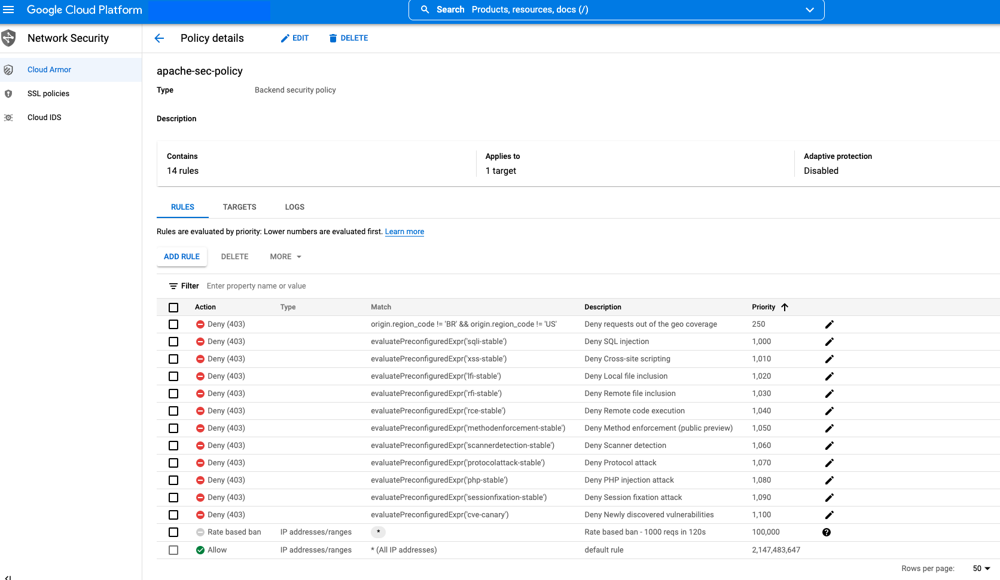

# Cloud Armor

## Description

This example demonstrates how to use Clour Armor to protect a web server.

Resources created:
- VPC
- Managed Instance Group with Apache VM
- Cloud Armor with WAF rules and Rate limit



## Deploy

1. Create or select an existing project
2. Open Cloud Shell and clone this repo into the Cloud Shell VM
```
git clone https://github.com/sylvioneto/terraform_gcp.git
```
3. Ensure the var is set, otherwise set it with `gcloud config set project` command
```
echo $GOOGLE_CLOUD_PROJECT
```

4. Create a bucket to store your project's Terraform state
```
gsutil mb gs://$GOOGLE_CLOUD_PROJECT-tf-state
```

5. Enable the necessary APIs
```
gcloud services enable cloudbuild.googleapis.com compute.googleapis.com cloudresourcemanager.googleapis.com logging.googleapis.com monitoring.googleapis.com 
```

6. Go to [IAM](https://console.cloud.google.com/iam-admin/iam) and add `Editor` and `Project IAM Admin` role to the Cloud Build's service account `<PROJECT_NUMBER>@cloudbuild.gserviceaccount.com`.

7. Execute Terraform using Cloud Build
```
cd ./terraform_gcp/cloud-armor
gcloud builds submit ./terraform --config cloudbuild.yaml
```

## Testing
You can use tools such as [dirsearch](https://github.com/maurosoria/dirsearch) to test your setup.

## Destroy
1. Execute Terraform using Cloud Build
```
cd ./terraform_gcp/cloud-armor
gcloud builds submit ./terraform --config cloudbuild_destroy.yaml
```
