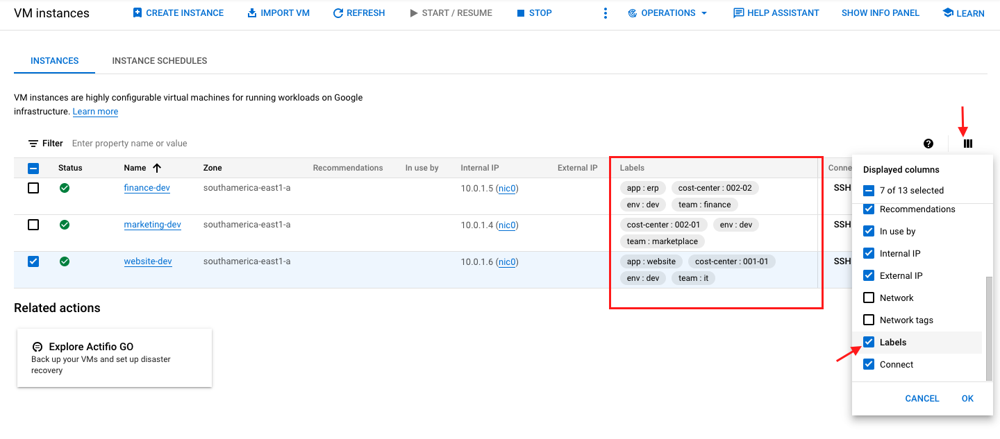

# Cost Management

## Description
This example demonstrates how to use resource labels to 1) organize your VMs, and 2) monitor better your GCP spending.
It creates an environment with VMs that have the labels: team, cost-center, env, and app.
As a result, you can use the Cloud Billing and Data Studio to explore your GCP spending data grouping them by labels according to your business.

Pre-req:
- [Setup Billing Exporter](https://cloud.google.com/billing/docs/how-to/export-data-bigquery-setup)
- [Setup GCP Cost Summary dashboard](https://cloud.google.com/billing/docs/how-to/visualize-data)

## Deploy

1. Create a new project and select it
2. Open Cloud Shell and clone this repo into the Cloud Shell VM
```
git clone https://github.com/sylvioneto/terraform_gcp.git
```
3. Ensure the var is set, otherwise set it with `gcloud config set project` command
```
echo $GOOGLE_CLOUD_PROJECT
```

4. Create a bucket to store your project's Terraform state
```
gsutil mb gs://$GOOGLE_CLOUD_PROJECT-tf-state
```

5. Enable the necessary APIs
```
gcloud services enable cloudbuild.googleapis.com \
compute.googleapis.com \
container.googleapis.com \
cloudresourcemanager.googleapis.com
```

6. Go to [IAM](https://console.cloud.google.com/iam-admin/iam) and add `Editor` and `Security Admin` role to the Cloud Build's service account `<PROJECT_NUMBER>@cloudbuild.gserviceaccount.com`.

7. Execute Terraform using Cloud Build
```
cd ./terraform_gcp/cost-management
gcloud builds submit . --config cloudbuild.yaml
```

To see your VMs with labels, please mark the Labels checkbox in the displayed columns.


Wait at least 24h before checking your billing data with Data Studio or Cloud Billing since the Billing Export needs time to register the usage.


## Destroy
1. Execute Terraform using Cloud Build
```
cd ./terraform_gcp/cost-management
gcloud builds submit . --config cloudbuild_destroy.yaml
```
